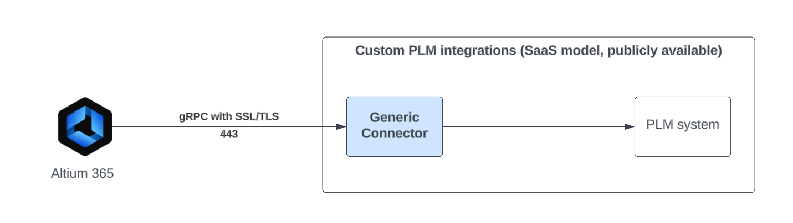

# Welcome to the docs
This is the documentation for **Nexar Generic PLM Connector**.

This generic connector solution should act as an accelerator for integrating your PLM solution with A365. Generic Connector works as an adapter between Altium 365 and PLM system. 
It exposes gRPC endpoint used by A365 to communicate with arbitrary PLM instance. 

This solution provides a base implementation of gRPC endpoints. 
It also provides a simple, file based, implementation that acts as a PLM file server (**FilesystemPLMDriver** project). 
It can be used to test the configuration and observe the flow of typical sync operations.

Inside this documentation, there are some instructions and example configuration files that will ease the process of code development and testing.