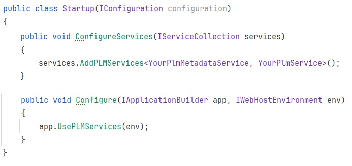
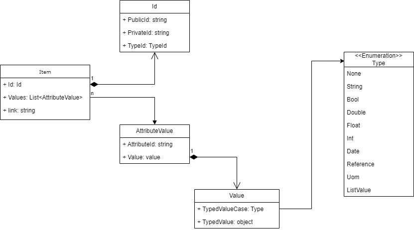
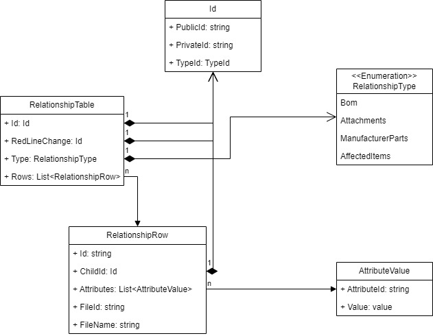
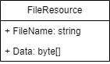

# Solution Description

## 1000-foot view
The solution in this repository consists of two main parts. One, is the base implementation of the gRPC service needed by the *Nexar Generic PLM Connector* to start 
connection between A365 and this generic connector. The other is an example implementation of file based PLM system, that can act as a point of reference. 
It requires .NET 8.0 to be installed on the system. The .NET 8.0 SDK can be downloaded from [Microsoft .NET download page](https://dotnet.microsoft.com/en-us/download/dotnet/8.0) 

When using this template project, implementing party only has to implement two interfaces that will later be used for the communication process. These interfaces are:

| Interface                 | Description                                                                                                                                                                                                                                                                                                                                                                                                                                                                        |
|:--------------------------|:-----------------------------------------------------------------------------------------------------------------------------------------------------------------------------------------------------------------------------------------------------------------------------------------------------------------------------------------------------------------------------------------------------------------------------------------------------------------------------------|
| ICustomPlmMetadataService | This interface is responsible for providing metadata information about your PLM system.  It provides information about types and their attributes that are exposed by your implementation of this generic connector solution. Based on the information received from this interface, inside A365 configuration, you will be able to create a mapping between the types known in Altium ecosystem (Capacitors, Resistors etc.) and the types native to your PLM implementation. |
| ICustomPlmService         | This interface is the heart of communication between A365 and your PLM service. It is responsible for storing and retrieving items from and to A365.                                                                                                                                                                                                                                                                                                                               |

This accelerator solution provides some extension methods that will make it easy to register all the necessary middleware to run the gRPC service:

Those extension methods will register your implementations, together with Global Exception filter, Automapper profiles, Logger configuration etc, creating working service out of a box.  
It creates a distinct separation between the gRPC required datamodel and application logic. It also ensures that Auth data that is received by the
gRPC controller is always available by a simple injection of <code>IContext</code> instance.

## Models
To hide the details of gRPC DTO models, **CustomPLMService** project is mapping all API related transfer objects into models defined in **CustomPLMService.Contract**. 
This is done using the automapper profile (located at **CustomPLMService/PlmServiceMappingProfile.cs**).

The most interesting models from this list are:
### Item (Item.cs)
Represents object in PLM system

### RelationshipTable (RelationshipTable.cs)
Represents object relationships table in PLM system. This table contains list of relationships of the object with other objects.

### FileResource (FileResource.cs)
Represents file uploaded to the custom connector side. Used as a staging area mostly for attachments that later are defined by RelationshipTable (during CreateRelationships operation)

## Filesystem PLM Driver
This project represents a very simple file based implementation of PLM integration. It's role is to provide an easy way
of learning the way the A365 runs sync/publish operation giving hands on debug experience without 
investing too much of the development time.

The first part of this implementation that is interesting (for testing purposes) is how the metadata is handled.
The list of component types and their attributes is defined in *appsettings.json* file. When started, the service will
read this data, and when asked for supported data types, return all of the defined ItemTypes each containing the same list
of AttributeNames. While this is not a perfect solution, as all ItemTypes share same attributes, it is enough to configure
simple PLM Connection.

Second part of Filesystem PLM Driver is the implementation of the file based PLM service. All the data stored by this solution
is kept in the *items* folder, located at the root of working directory. The data is stored by human readable form, as a simple XML
document. 

What is worth mentioning, while almost all methods read data from the xml files, *ReadRelationship* method, generates fake
data on the fly. This should be kept in mind when running Publish operations.