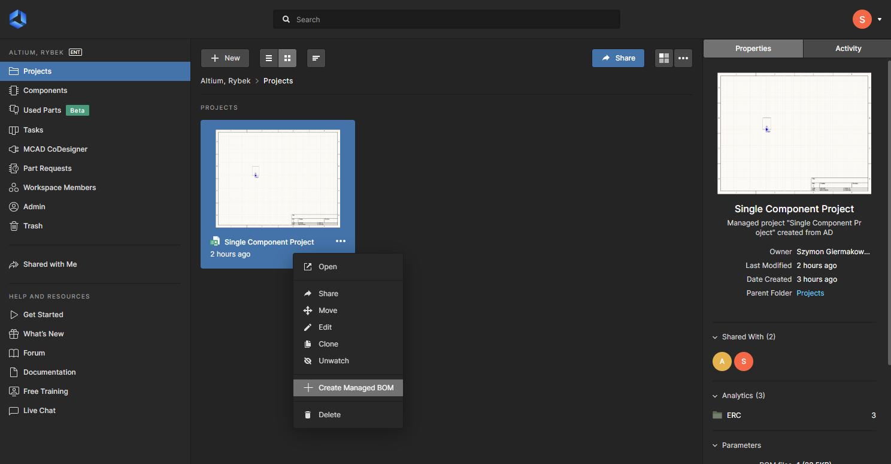
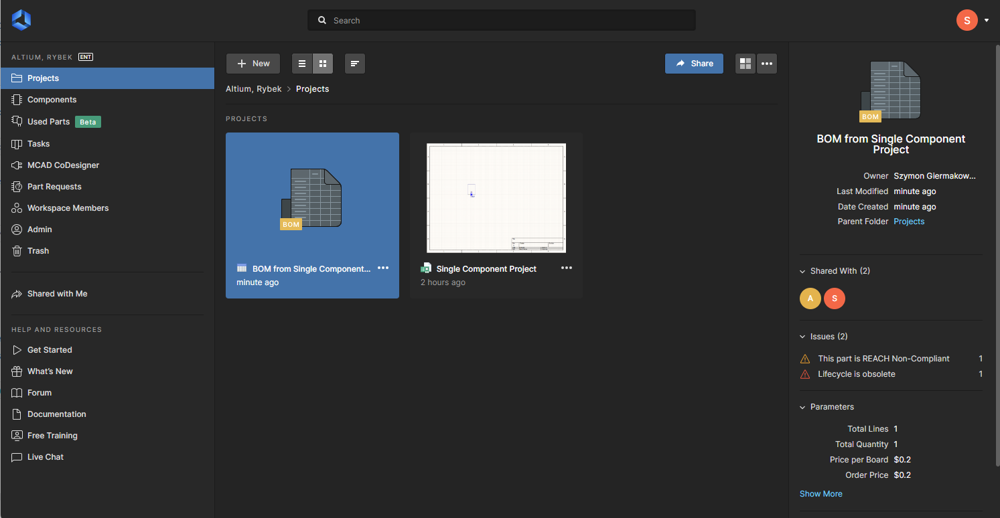
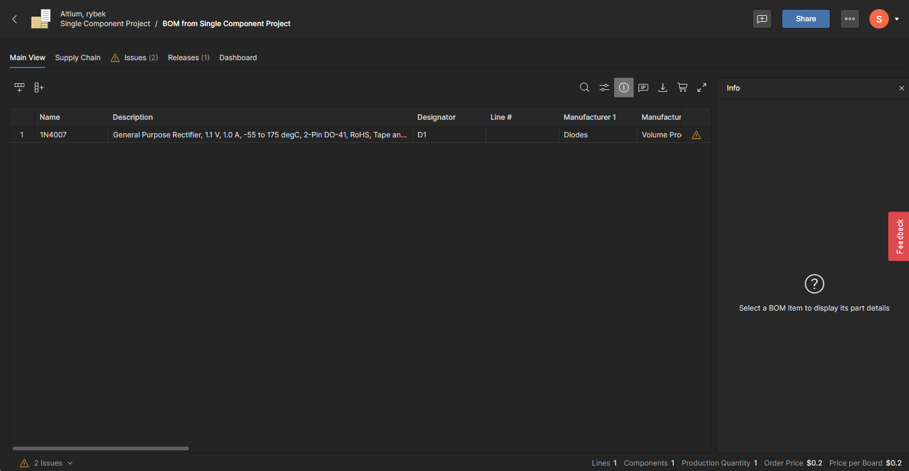
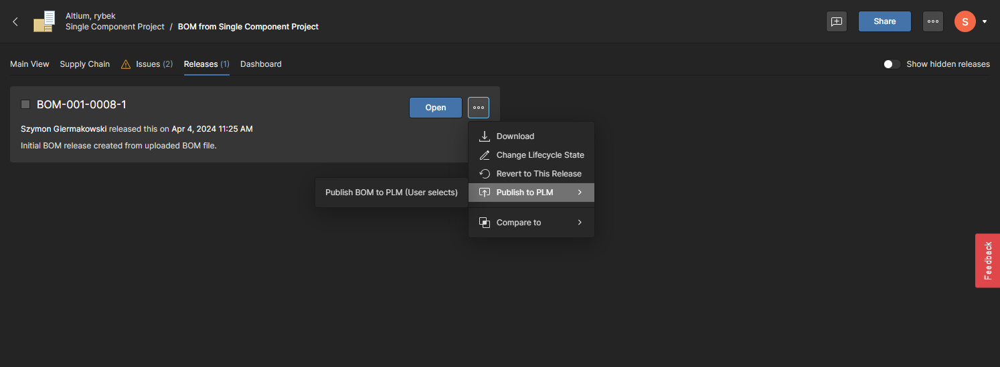
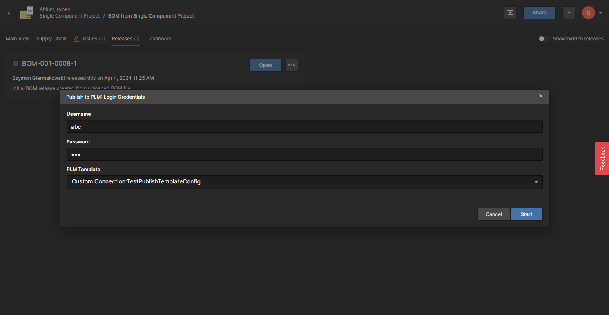
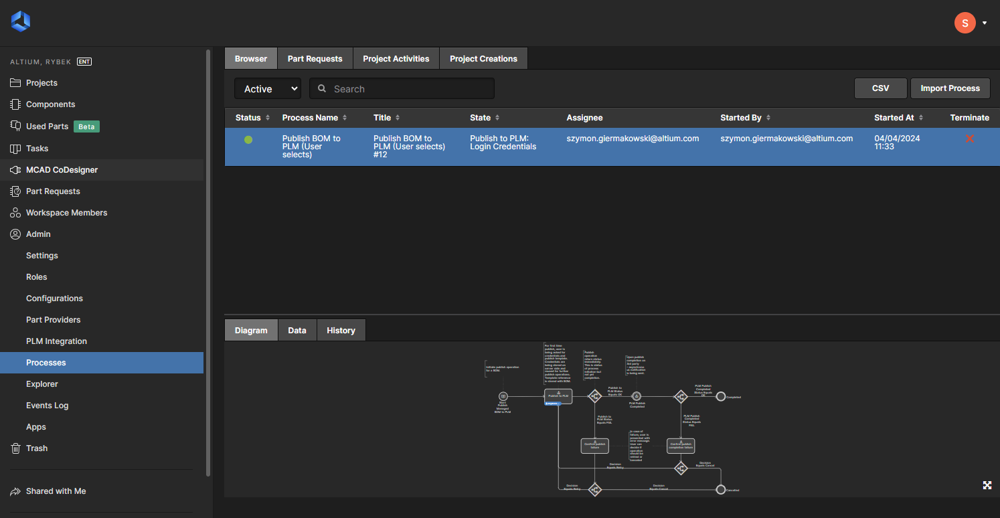
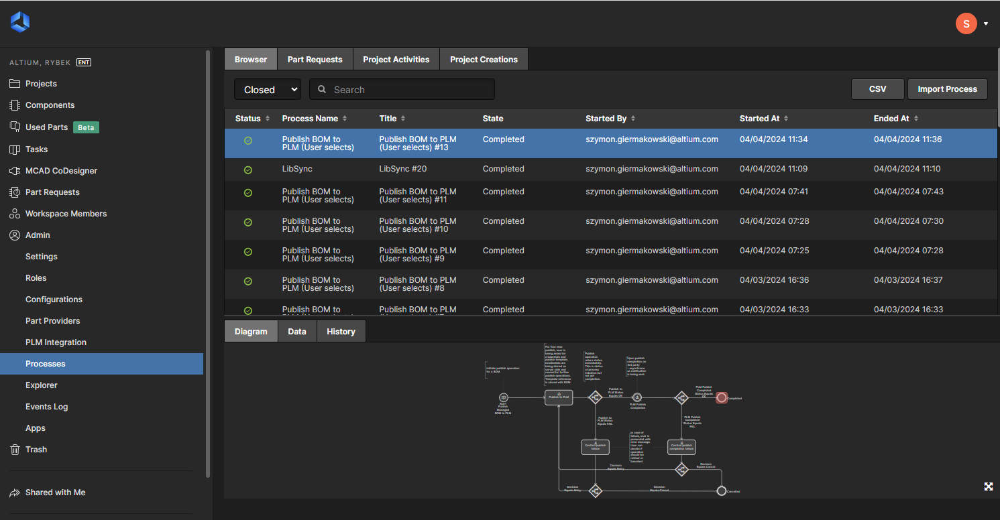

This document, will give step by step guide on how to make a simple test using this custom connector service and A365 environment

# Prerequisites
1. Altium 365 Workspace
2. Altium Designer installed on a system
3. Enterprise license for Altium 365 and licence for Generic Connector
4. User with administrator role

## Creation of dummy project
In order to run operations as Publish BOM or Publish Project, we need to have an actual project to publish. 
Since we do not need it to represent an actual working design, we can create a simple, single component project file. 
To do so, open Altium Designer and connect to your workspace. From menu **File**, select **New->Project** and create an
empty project called *Single Component Project*

Since the project is empty, we have to add something to it. To do so, right click on the project name in the *Projects* panel
(by default visible on the left) and select **AddNewToProject->Schematic**. This will create new, empty schematic. On the right
hand side, there is a **Component** panel. Open it and search for a simple diode (1N4007). Place it on the schematic, and create
a simple circuit (wires can be added by clicking *Ctrl + W* or selecting *Place Wire* from the menu in the top of the schematic view).
Create a diagram similar to the one below:

Now we have to tidy up the view. From the menu, select **Tools->Annotation->Annotate Schematic Quietly**. This will change the *D?* into
properly defined *D1* diode. Additionally, on the Projects view (left hand side), click on *Create* just next to ActiveBOM item. 

Now, we will also need a PCB design, based on our schematic. Right click on your project, and select **AddNewToProject->PCB**.

This will create a new PCB layout document. Currently it is empty, and we would like it to represent our single diode schematic.
To achieve that, select **Design->Import Changes From Single Component Project.PrjPcb**.

Select **Execute Changes** on the popup window.

This will result in a diode appearing in lower right side of the PCB design. Drag it to the center of the board. Last thing
to be done is to make a fake connection between the pin of the diode. Simply select **Interactively Route Connections** from the
top bar menu (or press Ctrl +W).

Create a short circuit between two diode pins. It doesn't make sense from the electrical point of view, but is enough for
Altium Designer to be able to later release the project.

From the projects view (left hand side), click *Save to Server* and follow all the instructions.

## Enable process for Publish
In order to be able to publish a project to PLM, the required process needs to be enabled. This can be done by accessing
A365 web view and navigating to **Admin->Processes**. Open tab called *Project Activities*. Notice that *Publish to PLM (user selects)* process
is not active.

In order to change that, one has to go into edit view (three dots menu). In the edit view, click on the blank space and provide
name for the process. Call it *Publish to PLM* and click *Save and Deploy*.

The result should be that the *Publish to PLM* process will be available and marked as active.

To verify, that everything works as expected, open Altium Designer and right click on the project. Verify that the context
menu *Project Activities* entry contains *Publish to PLM* option. 

## Releasing the project
In order to publish a project, it has to be first released, so that all the necessary files (GerberFile, Drill holes etc)
are generated. To do so, open Altium Designer and right click on the *Single Component Project*. Select *Project Releaser...* menu item.

If asked about *Default Outputs* generation, select *Add Defaults*. On the release view, select *Prepare*.

As an output, we expect all the validation to pass green, giving us following view.

Now we can finally press **Release** button. The final view should be as follows:

## Configuring the Connector
In Altium Designer, right click on the project and select **Show in web browser**. This will redirect you to A365 web view.
In the upper left corner, click the *back* icon, to return to your workspace view. From there, select **Admin->PLM Configuration** view:

At this point, you should have your CustomPLMService running. If you are working on your development machine, you will need to expose this
service to the internet. One of the methods to do it, is to use **ngRok** application. Free tier will be more than enough. Start ngRok using command **ngrok tcp 8008**.

Copy the IP address and port provided by ngrok. It will be needed on the next step. Get back to A365 web view and click on **Add Configuration**. Give your configuration
a meaningful name and in the *PLM Connection* section, change the driver to *Generic Connector*. Enter the IP address and port from the ngrok into the URL field.
Enter random username and password, as the default implementation in CustomPLMService doesn't verify it. Click **Test Connection**. If everything is ok with connection
between your CustomPLMService and A365, you should see a configuration view as follows:

What we will be interested in is the *Sync Parameters* block. To keep it simple, for this configuration we will only select Diodes with direction of *To PLM*, meaning that 
during the sync process, Altium will make sure that all used Diode components are stored in the PLM. To set up such configuration, we have to set the *Sync Direction* on the Diodes
row to *To PLM*. Next, we have to inform A365 what type should be used on PLM side (as the component types doesn't have to be the same between A365 and PLM). The list of available 
PLM Types is the result of gRPC call to CustomPLMService metadata. For details on how to add/configure new types, please visit [Solution Description](./solution.md).
After selecting proper PLM Type and desired component types to sync, click *Refresh Data* to ensure that all attributes of selected component types will be available. 
Last thing to do is to define Component Parameters Mapping. We need at least one mapped parameter, that will act as a Primary Key. In the following example, two parameters have 
been configured. Notice, that the *ID* one was typed by hand (Altium parameter name doesn't have to be from the drop down list). While this configuration doesn't make too much
of sens for production use case, it will be sufficient for basic testing.

To keep things simple, in the **Part Choices** section, change Sync Direction to *OFF*. This will disable the *Part Choices* sync making the sync operation simple.

Next step to be done is to define **Publish Template**. This will be needed for testing publish operations. Go to the **Publish Template* tab and select **Add Template**. 
Define a name for the template (*TestPublishTemplateConfig*) and upload [this](./assets/testPublishTemplate.xml) xml configuration. 

Repeat the operation with [this](./assets/testPublishBOMTemplate.xml) xml. 
This one can be called (*TestPublishBOMTemplateConfig*). You can also make your own xml, configuration, but for initial testing, it is recommended to keep it simple.
When finished, this view should look something like:

When done, press **Save** in upper right corner, and the simple PLM Integration configuration will be ready.

# Sync Operation
In order to start sync operation, open A365 workplace web view, and navigate to Component Sync view (**Admin->PLM Integration**).

Make sure you have your CustomPLMService running and that the IP address haven't changed, and press the **Run Sync** action. The view will be updated automatically
indicating that the sync operation is in progress. The sync type depends on the configuration. Possible options are: *To PLM*, *To Altium* and *To PLM and Altium*.

After a short moment, the view should change indicating success.

In case of any failures, you can see more details on the **Synchronization Status** tab. Select the failed sync instance and
in the bottom view, select **data**. 

Some hints on the root case for the problem might be visible in *Notification Message* or in *Notification Log*. Please refer to [FAQ](./faq.md) for solutions
for most common problems.

# Publish Project
Before proceeding, make sure that project was already released, and that publish operation has been activated (Prerequisites section).
In order to publish a project, you will have to open Altium Designer application. Right click on the project and select **Publish to PLM..**.

On the *Publish to PLM* window, click **Start**. On the *Select data to publish* view, pick a recent release and click **Submit**.

You will be asked for user credentials and to select a proper publish template. Unless any changes have been made to CustomPLMService
solution, any credentials will work fine. As for the publish template, select *TestPublishTemplateConfig* and click **Submit**.

After pressing the **Submit** button, the publish operation will commence. It can be monitored using **Tasklist** view, 
which can be opened by clicking on **Panels** button on lower right part of Altium Designer.

Example of a visible ongoing publish operation in **tasklist** view is as follows:

The downside of this view is that it shows only ongoing operations. As soon as the publish operation finishes (either by failure or by success),
it will disappear from this view. Far better option is to monitor *Processes* view from the A365 workspace web app (section **Admin->Processes**).
It allows to see both failed and successful runs, and access additional data as log of the operation

# Publish BOM
> [!WARNING]
> There is a known bug in this solution that makes Publish BOM operation fail, if the whole project already published. We are 
> working on it. As a workaround, simply delete *items* folder that was created in the root directory of the project
> (If started in debug mode from IDE, it will be located at *FilesystemPLMDriver\bin\Debug\net8.0*).

In order to be able to start *Publish BOM* operation, we need to have a proper managed Bill Of Material file. To get it, open A365 workspace **Projects** view.
Under your *Single Component Project*, click the three dots icon and select **Create Managed BOM**.

This will result in creation of new item on the projects view.

Double click managed BOM tile to enter the Managed BOM view.

As can be seen, there are not a lot of items here. But that will be enough to make a most simple BOM Publish operation. To start the process
navigate to **Releases** tab. On the tile that represents the BOM release, click on three dot icon and select **Publish to PLM** option.

After starting the process, you might be asked for credentials. These are credentials that will be used during the *Auth* call
to the CustomPLMService. In this basic implementation of the service, you can provide any data there.

In order to monitor the state of this operation, you can open the **Admin->Processes** view on A365 Workspace web view.
It will allow you to see the current state of the BOM Publish process and any potential error messages. The default view
shows ongoing instances.

To track finished processes, simply change the value of the drop down from the upper left side of the view to *Closed*.

