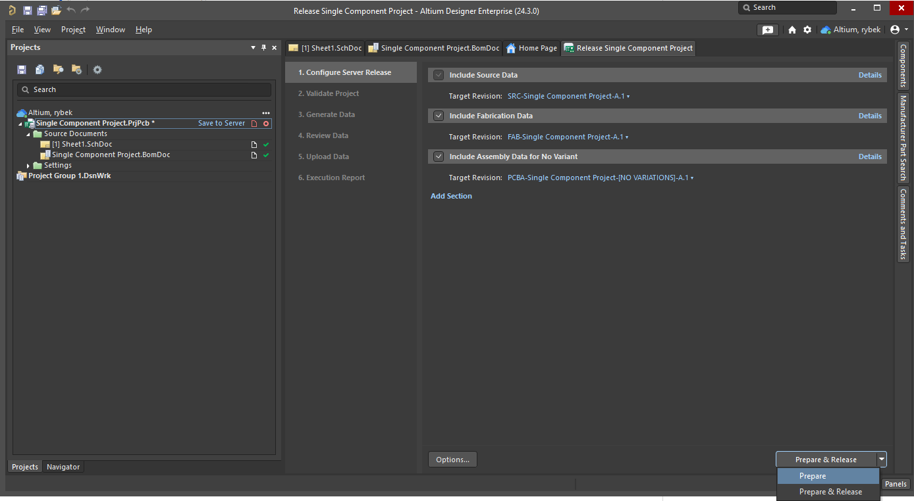
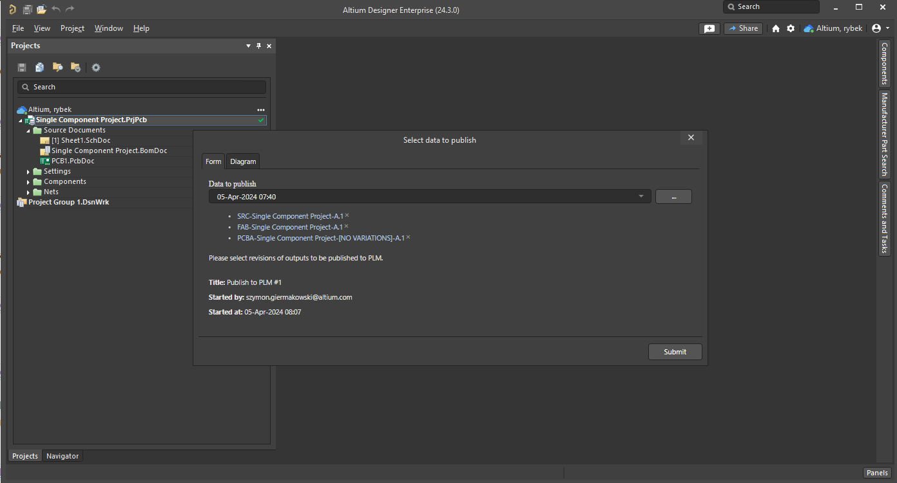
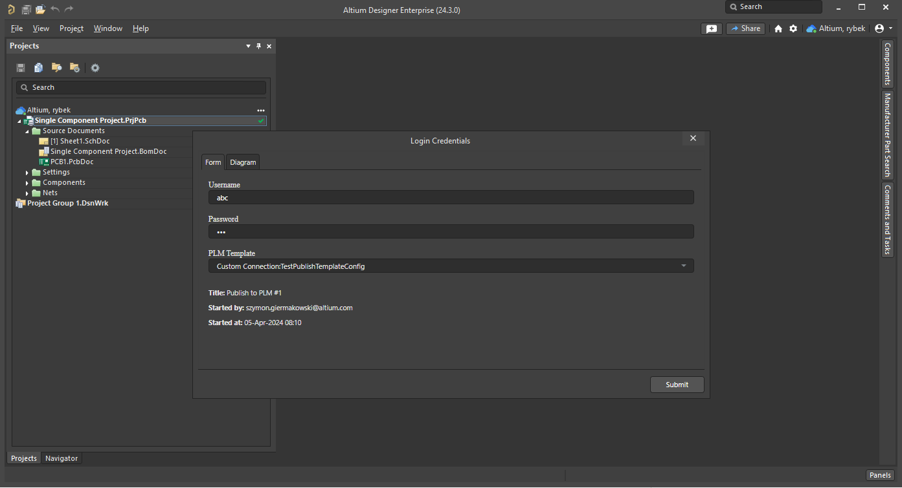

This document is a step-by-step guide outlining how to make a simple test using the custom connector service and Altium 365 environment.
By following it, you will create a simple project, configure the connection to Generic Connector and configure publish process. 
You will also run basic operations, such as **Sync**, **Part Choice** or **Publish Project**, which also includes BOM Publication. The goal is that
with help of content of this document, you will be able to test all the most common operations that are supported by Generic Connector.

# Prerequisites
1. Altium 365 Workspace
2. Altium Designer installed on the system
3. Enterprise license for Altium 365 and licence for Generic Connector
4. User with administrator role

## Creation of a Dummy Project
In order to run Publish Project operations, there needs to be an actual project to publish. 
Since the project does not need to represent an actual working design, we can create a simple, single-component project file. 
To do so, open Altium Designer and connect to your workspace. From the main menus, select **File > New > Project**. Create an
empty project called *Single Component Project*

Since the project is empty, documents need to be added. Right-click on the project name in the *Projects* panel
(by default, the panel is visible on the left) and select **Add New to Project > Schematic**. This will create a new, empty schematic. 
Open the *Components* panel by clicking the **Panels** button on the bottom right, then selecting **Components**.
Use the panel to search for a simple diode (1N4007). Place it on the schematic. Create
a simple circuit by adding wires. Click **Ctrl+W** or choose **Place > Wire** from the main menus.
Your schematic should look similar to the one below.

Now, let's add details to the document. From the main menus, select **Tools > Annotation > Annotate Schematic Quietly**. This will change the *D?* into
a properly defined *D1* diode. Additionally, in the *Projects panel*, click *Create* next to the ActiveBOM entry. 

We will also need a PCB document based on our schematic. Right-click on your project, then select **Add New to Project > PCB**.

This will create a new PCB document. Currently, it is empty and we would like it to represent our single diode schematic.
Select **Design > Import Changes From Single Component Project.PrjPcb**.

Click the **Execute Changes** button in the *Engineering Change Order* dialog that opens.

This will result in a diode appearing in lower right side of the PCB design. Drag it to the center of the board. 
Now let's create a "fake" connection between the pins of the diode. Click **Interactively Route Connections** from the
Active Bar menu at the top of the PCB (or press **Ctrl+W**).

Create a short circuit between two diode pins. This is incorrect from an electrical point of view,
but this is only for so that Altium Designer can release the project later.

In the *Projects panel*, click **Save to Server** and follow all the instructions.

## Enable the Publishing Process
In order to be able to publish a project to PLM, the required process needs to be enabled. This can be done by accessing
Altium 365 web view and navigating to **Admin > Processes**. Open the **Project Activities** tab. Notice that the **Publish to PLM (user selects)** process
is not active.

To enable the process, click the three dots associated with the process. In the edit view, click the blank space and provide
a name for the process. Use **Publish to PLM** then click **Save and Deploy**.

The result is that the **Publish to PLM** process is available and active.

To verify that everything works as expected, open Altium Designer then right-click on the project. 
Verify that the *Project Activities* context menu entry includes **Publish to PLM**. 

## Releasing the Project
In order to publish a project, it has to be first released so that all the necessary files (Gerber, Drill holes etc)
are generated. Open Altium Designer then right-click on the **Single Component Project** entry. Select **Project Releaser...**.

When promped about **Default Outputs** generation, select **Add Defaults**. In the project release document, select **Prepare**
from the drop-down on the bottom right.

The validation should pass with all green, thus, you should see following.

You can now press the **Release** button. The final view should be as shown below.

## Configuring the Connector
In Altium Designer, right-click on the project in the *Projects* panel then select **Show in Web Browser**. This will redirect you to the Altium 365 web view.
In the upper left corner, click the *back* icon to return to your workspace view then, select **Admin > PLM Configuration** as shown below.

At this point, you should have your CustomPLMService running. If you are working on your development machine, you will need to expose this
service to the Internet. One way to do this, is to use the **ngRok** application. Free tier will be more than sufficient. 
Start **ngRok** using the **ngrok tcp 8008** command.

Copy the IP address and port provided by **ngRok** as it will be needed in the next step. Return to the Altium 365 web view then click **Add Configuration**. 
Give your configuration a meaningful name, and in the **PLM Connection** section, change the driver to **Generic Connector**. 
Enter the IP address and port from the **ngRok** into the URL field.
Enter a random username and password, as the default implementation in CustomPLMService does not verify it. 
Click **Test Connection**. If everything is ok with the connection between your CustomPLMService and Altium 365, the view will look like the image below.

We are interested in the **Sync Parameters** block. To keep it simple, for this configuration we will only select Diodes with the direction of *To PLM*, meaning that 
during the sync process, Altium will make sure that all used Diode components are stored in the PLM. To set up such a configuration, we have to set the *Sync Direction* on the Diodes
row to *To PLM*. Next, we have to inform Altium 365 what type should be used on the PLM side (as the component types do not have to be the same between Altium 365 and PLM). 
The list of available PLM Types is the result of the gRPC call to CustomPLMService metadata. For details on how to add/configure new types, please visit [Solution Description](./solution.md).
After selecting the proper PLM Type and desired component types to sync, click **Refresh Data** to ensure that all attributes of selected component types will be available. 
The last thing to do is define Component Parameters Mapping. We need at least one mapped parameter that will act as a *Primary Key*. In the following example, two parameters have 
been configured. Notice, that the *ID* parameter was entered manually (the Altium parameter name does not have to be from the drop-down list). 
While this configuration does not make much sense for a production use case, it will be sufficient for basic testing.

To keep things simple, in the **Part Choices** section, change **Sync Direction** to *OFF*. This will disable the *Part Choices* sync, which makes the sync operation simpler.

The next step is to define the **Publish Template**. This will be needed for testing publishing operations. Go to the **Publish Template** tab and select **Add Template**. 
Define a name for the template (*TestPublishTemplateConfig*) and upload [this](./assets/testPublishTemplate.xml) xml configuration. 

Repeat the operation with [this](./assets/testPublishBOMTemplate.xml) xml. 
Name this one *TestPublishBOMTemplateConfig*. You can also make your own xml configuration, but for initial testing, it is recommended to keep it simple.
When finished, this view should look similar to the image below.

When done, press **Save** in the upper right corner. The simple PLM Integration configuration is now ready.

# Sync Operation
In order to start the sync operation, open the Altium 365 web view and navigate to the Component Sync view (**Admin->PLM Integration**).

Make sure you have your CustomPLMService running and that the IP address has not changed then press the **Run Sync** button. The view will be updated automatically
indicating that the sync operation is in progress. The sync type depends on the configuration. Possible options are *To PLM*, *To Altium* and *To PLM and Altium*.

After a moment, the view should change indicating success.

In case of any failures, you can see more details on the **Synchronization Status** tab. Select the failed sync instance, 
then in the bottom region, select the **Data** tab. 

Hints about the root case of the problem might be visible in **Notification Message** or **Notification Log**. Refer to the [FAQ](./faq.md) document for solutions
to the most common problems.

# Part Choices
## To PLM
Part Choices operation (if enabled) begins after a successful Sync operation. In order to start it, you will have to enable it in
the **Admin > PLM Configuration** view of the Altium 365 web view. To do so, edit the **Component Sync** configuration. Important to notice
is that only the **PLM Part Attributes** is supported as **Part Choice Information**. Also, for each *Part Choice* entry in
the Altium 365, additional **Attribute Definition** row needs to be created. For example, if given component has two Part Choice entries, 
it requires two rows in **Attribute Definition**, each exposing different attribute name. 

When configuration is saved, the **Sync Operation** needs to be started. The **Part Choices** sync will fallow right after.

## To Altium
TBD

# Publish Project
Before proceeding, make sure that the project was already released and that the publish operation has been activated (in the **Prerequisites** section).
Note that BOM publication is part of the publish process.
In order to publish a project, you will have to open Altium Designer. Right-click on the project then select **Publish to PLM**.

On the *Publish to PLM* view, click **Start**. In the *Select data to publish* dialog, pick a recent release then click **Submit**.

You will be asked for user credentials and to select a proper publish template. Unless any changes have been made to the CustomPLMService
solution, any credentials will work fine. As for the publish template, select *TestPublishTemplateConfig* then click **Submit**.

After pressing the **Submit** button, the publish operation will begin. It can be monitored using the **Tasklist** view, 
which can be opened by clicking the **Panels** button at the bottom right of Altium Designer then selecting **Tasklist**.

An example of an in progress publish operation in the **Tasklist** panel is shown below.

The downside of the panel is that it shows only in progress operations. As soon as the publish operation finishes (either by failure or successful completion),
it will disappear from the panel. A far better option is to use **Processes** from the Altium 365 web view (section **Admin > Processes**).
It allows you to see both failed and successful runs, and access additional data of the operation

