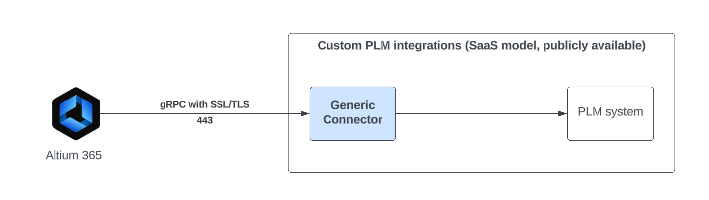

# Nexar Generic PLM Connector

Nexar Generic PLM Connector (referred to as Generic Connector) framework exposes gRPC endpoints used 
by Altium 365 to communicate with arbitrary PLM instances. It can be used to provide integration with the unsupported PLM systems. 

It works as a man-in-the-middle between Altium 356 and custom PLM system, taking the role of an adapter. It is responsible
for translation of models and operations types used by Altium 365 into the format acceptable by the custom PLM system.

Generic Connector is distributed as a [C#](https://github.com/NexarDeveloper/nexar-plm-connector-cs) service application with associated documentation and example configuration files.
Generic Connector framework comes with a working example of integration using a simple file system storage 
that can be deployed and connected to the Altium ecosystem, which is a great starting point 
for a custom implementation.

Please refer to [PLM Integration with an Altium 365 Workspace](https://www.altium.com/documentation/altium-365/plm-integration)
for detailed information on [Altium 365](https://www.altium.com/altium-365) integration options with PLM systems.

## References
 - [Articles](articles/intro.md)
 - [API Reference](api/index.md)